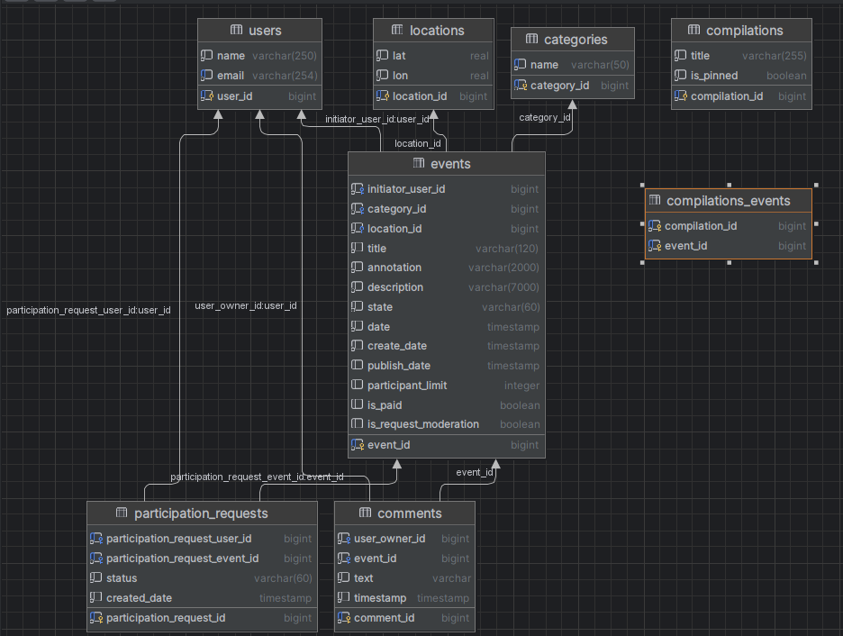

# explore-with-me

Микросервисное приложение, позволяющее пользователям делиться информацией об интересных событиях и находить компанию для
участия в них.

---
Использованы следующие инструменты:

- Spring Boot 2.7.9
- JPA Hibernate
- PostgreSQL
- Lombok
- Docker
- Swagger

---

### Два сервиса:
[Основной сервис](#основной-сервис)

[Сервис статистики](#сервис-статистики)

---

##  Основной сервис

Содержит всё необходимое для работы продукта. 

API сервиса делится на три части:
- *публичная* доступна без регистрации любому пользователю сети;
- *закрытая* доступна только авторизованным пользователям;
- *административная* - для администраторов сервиса;

**Публичный API**

Предоставляет возможность поиска и фильтрации событий. При этом:
- сортировка списка событий организована либо по количеству просмотров, которое запрашивается в сервисе статистики, либо по датам событий;
- при просмотре списка событий возвращается только краткая информация о мероприятиях;
- просмотр подробной информации о конкретном событии настроен отдельно (через отдельный эндпоинт);
- каждое событие должно относится к какой-то из закреплённых в приложении категорий;
- настроена возможность получения всех имеющихся категорий и подборок событий (такие подборки составляют администраторы ресурса);
- каждый публичный запрос для получения списка событий или полной информации о мероприятии фиксируется сервисом статистики;

**Закрытый API**

Закрытая часть API реализовывает возможности зарегистрированных пользователей продукта. При этом:
- авторизованные пользователи имеют возможность добавлять в приложение новые мероприятия, редактировать их и просматривать после добавления;
- настроена подача заявок на участие в интересующих мероприятиях;
- создатель мероприятия имеет возможность подтверждать заявки, которые отправили другие пользователи сервиса;

**Административная API**

Административная часть API предоставляет возможности настройки и поддержки работы сервиса. При этом:
- настроена возможность добавление, изменение и удаление категорий для событий;
- имеется возможность добавлять, удалять и закреплять на главной странице подборки мероприятий;
- имеется возможность модерации событий, размещённых пользователями, — публикация или отклонение;
- настроено управление пользователями — добавление, активация, просмотр и удаление;

---
Схема базы данных **главного сервиса**

---

##  Cервис статистики

- собирает информацию о количестве обращений пользователей к спискам событий 
- собирает информацию о количестве запросов к подробной информации о событии

На основе этой информации формируется статистика о работе приложения.

Функционал сервиса статистики содержит:
- запись информации о том, что был обработан запрос к эндпоинту API;
- предоставление статистики за выбранные даты по выбранному эндпоинту;

---

## Спецификации API
[Основной сервис](ewm-main-service-spec.json)

[Сервис статистики](ewm-stats-service-spec.json)

