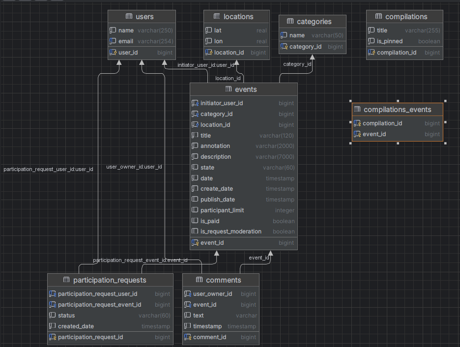
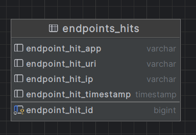

# explore-with-me

A microservice application that allows users to share information about interesting events and find a company to
participate in them.

---
The following tools were used:

- Spring Boot 2.7.9
- JPA Hibernate
- PostgreSQL
- Lombok
- Docker
- Swagger

---

### Two services:
[Main Service](#Main-Service)

[Statistics Service](#Statistics-Service)

---

##  Main Service

Contains everything necessary for the product to work.

The API of the service is divided into three parts:
- *public* available without registration to any network user;
- *closed* available only to authorized users;
- *administrative* - for service administrators;

**Public API**

Provides the ability to search and filter events. At the same time:
- sorting of the list of events is organized either by the number of views requested in the statistics service, or by the dates of events;
- when viewing the list of events, only brief information about the events is returned;
- viewing detailed information about a specific event is configured separately (via a separate endpoint);
- each event must belong to one of the categories fixed in the application;
- the ability to receive all available categories and collections of events is configured (such collections are made by resource administrators);
- each public request for a list of events or full information about the event is recorded by the statistics service;

**Closed API**

The closed part of the API implements the capabilities of registered users of the product. At the same time:
- authorized users have the opportunity to add new events to the application, edit them and view them after adding;
- submission of applications for participation in the events of interest is set up;
- the creator of the event has the opportunity to confirm applications sent by other users of the service;

**Administrative API**

The administrative part of the API provides the ability to configure and support the operation of the service. At the same time:
- the ability to add, change and delete categories for events is configured;
- it is possible to add, delete and pin on the main page of the collection of events;
- there is a possibility of moderation of events posted by users — publication or rejection;
- user management is configured — add, activate, view and delete;

---
Database schema **of the main service**

---

##  Statistics Service

- collects information about the number of user requests to event lists
- collects information about the number of requests for detailed information about the event

Based on this information, statistics about the operation of the application are generated.

The functionality of the statistics service contains:
- record information that a request to the API endpoint has been processed;
- providing statistics for selected dates for the selected endpoint;

---

Database schema **of the statistics service**

---

## API Specifications
[Main service](ewm-main-service-spec.json)

[Statistics Service](ewm-stats-service-spec.json)

